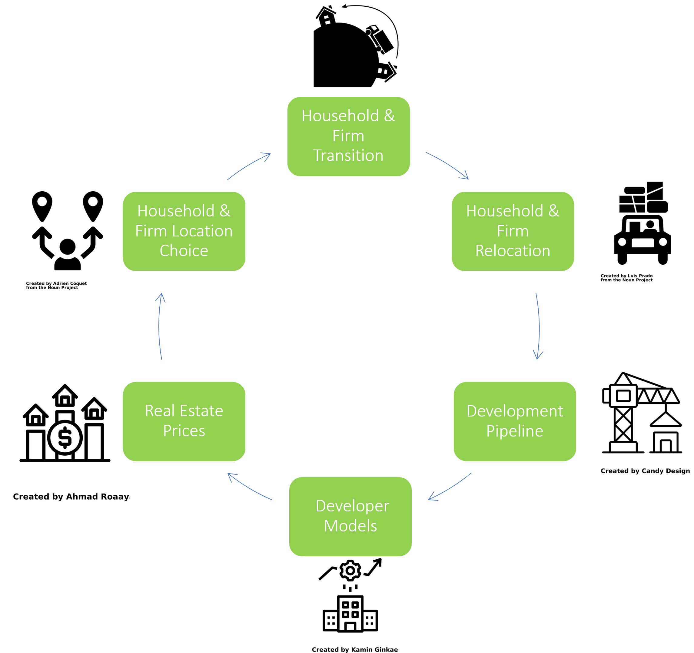
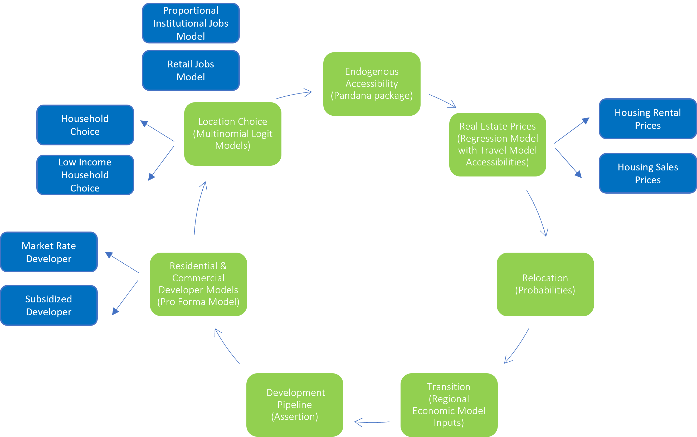

# Bay Area UrbanSim (BAUS)

### Model Overview

Bay Area UrbanSim (BAUS) is a microeconomic land use model used to forecast intraregional growth and study urban policies. BAUS simulates the movement of households and firms within the region and the construction of built space. The total number of households and jobs in the region in future years is forecast using the REMI regional economic model and additional demographic processing scripts. BAUS uses these projections incrementally forecast urban growth trajectories, with forecasted land use patterns then used in the regional travel demand model to evaluate future travel patterns.

Households, firms, and developers in BAUS act on the parcel as the model's base unit of analysis. Developers determine feasible parcels in the region to build housing units and jobs space. Households and firms choose where to locate based on behavioral model preferences for particular locations. The price of buildings in BAUS is updated each model time step to reflect local changes and changes in demand for particular areas, in turn altering the feasibility of redevelopment for developers. These core models run every five years to produce the land use forecast.

### BAUS Sub-Model Flow

A series of sub-models are used to simulate the decisions of households and firms in a land use forecast. The BAUS sub-models and their modeling methods are described below. Some BAUS models have been segmented to capture key elements of real estate markets, such as housing tenure, or to capture varying preferences among households and firms, such as the varying location preferences of different employment sectors. Additional models have been added that help model urban policies, such as the option to locate in affordable housing units.

### Accessibility Calculations
Pandana is open-source software package used to calculate endogenous accessibility variables. These generally describe how close a parcel is to something (e.g., BART) or how many things are nearby a parcel (e.g., number of jobs), informing both price prediction models and location choice models. Both local (local street network from Open Street Map) and regional (travel model network) networks are used to compute these variables.

### Price & Rent Prediction
Hedonic regression models are applied to current model year conditions to estimate both **prices and rents** in that year. ***Accessibillity information from the regional travel model is entered into these models, allowing future year travel conditions to influence real estate prices. This feature is central to MTC's integrated land use and travel modeling.***

### Household & Firm Relocation 
Households and firm are selected to move based on historic relocation probabilities. **Household move-out choice is conditional on tenure status**. Households and firms that are selected to relocate are added to the set of relocation agents looking for homes and job space, to be placed with the model's location choice models.

### Household & Firm Transition
***REMI is used to generate the model's control totals for region's total number of households and jobs, while BAUS outputs on housing production are used to adjust regional housing prices in REMI.*** Additional households and employees are added or subtracted from BAUS in each model time step to reflect the exogenous control totals. Any net additional households and firms are added to the set of relocation agents looking for homes and job space, to be placed with the model's location choice models. 

### Pipeline Project Development
Buildings in the region's development pipeline are constructed by entering the projects into the development poipeline list. These are often large approved development projects and development that has occurred after the model's base year. 

### Market-Rate Developer Model 
The for-profit real estate development model in BAUS samples locations in the region in order to evaluate potential development sites using a simplified pro forma model. Sub-features of the developer model include a zone-level model that asserts ADU development to reflect ADU policy and a ground floor retail model adds retail to multi-story buildings to reflect typical policy.

### Affordable Housing Developer Model
In many simulations, a similar **not-for-profit real estate development process** produces affordable housing units based on money available within BAUS affordable housing funding accounts.

### Household & Firm Location Choice Models
Households and firms are assigned to new locations based on logistic regresssion models that capture the preferences of particular segments of households and jobs (e.g., lower income households, retail jobs). Household location choice models are separated by **housing tenure.** Currently, a housing unit's tenure type is determined by the household's tenure status, while the tenure type of new units is determined by comparing rent vs price revenues. Additional household location choice models are also run that place househlds in **market rate and affordable housing units**. These models ensure low-income households are given priority for affordable housing units, allowing affordable housing to be explicity modeled in BAUS.

### Institutional Jobs Model
Particular industry sectors which don't follow traditional market economics are forecast separately from. For government and education jobs, the number of jobs grow over the simulation period in proportion to their zonal shares. The buildings that house these jobs are off-limits from redevelopment.

### Retail Model 
An additional retail model takes into account where demand for retail is high and supply is low to ensure there are retail services in each jurisdiction. Retail demand is a function of the number of households and household incomes.