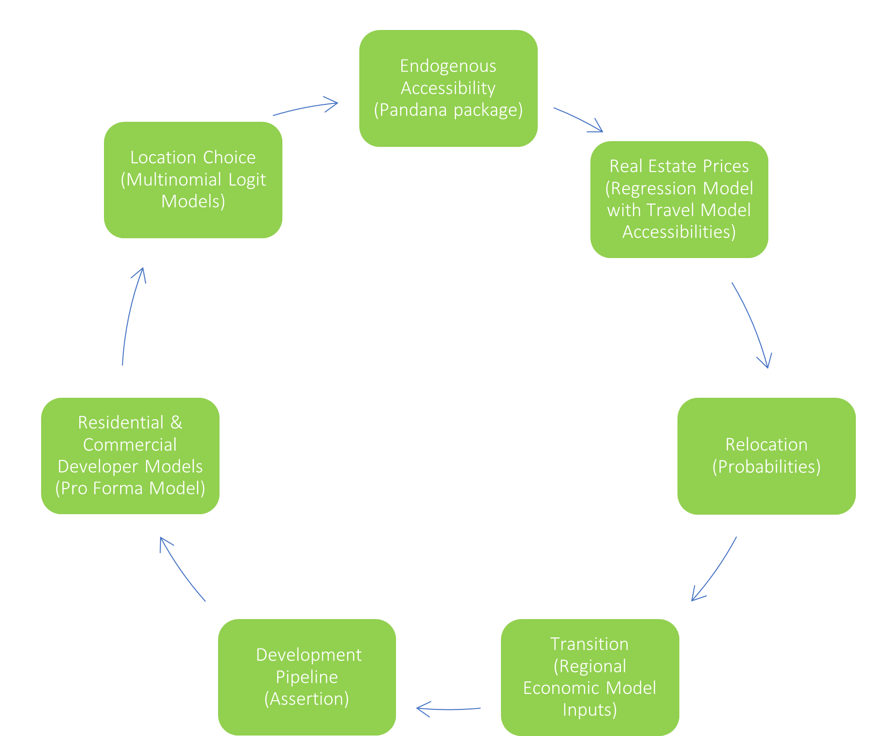

###  BAUS Scenarios

BAUS model runs have serveral optional levers that can be used to create a forecast scenario. These levers are used to observe potential outcomes of urban planning policies and natural hazards. Packages of changes can be applied to create modeling scenarios and forecast impacts on urban growth, equity, and the environment. Optional model features used to build BAUS scenarios are described below.

### Earthquake Model
This model simulates the impact of an earthquake occuring by destroying buildings based on a their locational likelihood of damage and their building attributes. Households and firms are displaced in the earthquake event to find new housing and job locations. The model then forecasts where redevelopment might occur. If mitigtion is applied in an earthquake simulation scenario, buildings are selected to be retrofit based on their building attributes, changing their damage likelihood.

### Sea Level Rise Model
Sea level rise model: The sea level rise model simulates the impact of sea level rise in a given year. Buildings impacted by sea level rise in that year are destroyed and their households and firms are displaced to search for new housing and job locations. A parcel that has been inundated sea level rise can no longer be developed. If mitigation is applied in a sea level rise simulation scenario, protected parcels are no longer impacted in their forecasted inundation year.

### Housing Preservation
This model randomly selects buildings to preserve in BAUS based on preservation targets established by geography. All deed-restricted affordable housing units in the model are treated in two ways. The first is that they cannot be redeveloped when the developer models examine potential sites. The second is that low-income households receive priority to locate in them in the location choice models using the models filters.

### Inclusionary Zoning
Inclusionary zoning sets a requirement that a percentage of new housing development must be affordable units. The default inclusionary settings in BAUS represent the existing requirements without plan strategy interventions. Scenario-based strategies can set inclusionary rates at a given geography level. The model calculates Area Median Income, feasible new affordable housing count, and revenue_reduction amount.

### Housing Cost Reduction
Reducing the cost of buildings housing can come in various forms: CEQA reform, lowering parking requirements, etc. These have the potential to make new projects profitable, especially when combined with other policies. For these policies, parcels within the specified geography decrease the required profitability level needed for the model to build on those parcels.

### Transportation Impact Fees
This policy is implemented by changing the cost of development in a zone based on the VMT in the area. Low VMT areas see a slight reduction in fees.

### Housing and Office Subsidies
Subsidies provide funding to either residential or commerical projects to improve their feasibility. A user-specified funding amount is applied to each model time step Development projects that are not feasible under market conditions are potentially qualified for subsidy. A qualified project draws money from the corresponding account to fill the feasibility gap. Not all qualified projects will be subsidized. 

### VMT Linkage Fees
These fees on new commercial or residential development reflect transportation impacts associated with such development, focusing primarily on new commercial spaces or residential units anticipated to have high employment-related or residence-related vehicle miles traveled (VMT). The fees are applied to the specified geogrpahy on a $/sqft basis for commercial development and $/unit basis for residential development. They can be used on commercial development to subsidize residential development, on residential development to subsidize residential development, and on commercial development to subsidize commercial development. Each parcel in a given geography is assigned a user-specified fee based on its categorized VMT-level. 

### Jobs-Housing Linkage Fee
This policy is mechanically similar to transportatin impact fees, but is a regional jobs-housing linkage fee to generate funding for affordable housing when new office development occurs in job-rich places, thereby incentivizing more jobs to locate in housing-rich places. The $/sqft fee assigned to each geography is a composite fee based on the jobs-housing ratio and jobs-housing fit for both cities and counties. 

### Office and Residential Construction Caps
These caps limit the number of new residential units and job spaces that can occur in a given geography. The default caps in BAUS are inherited in all model runs, including when scenario-based caps are added.